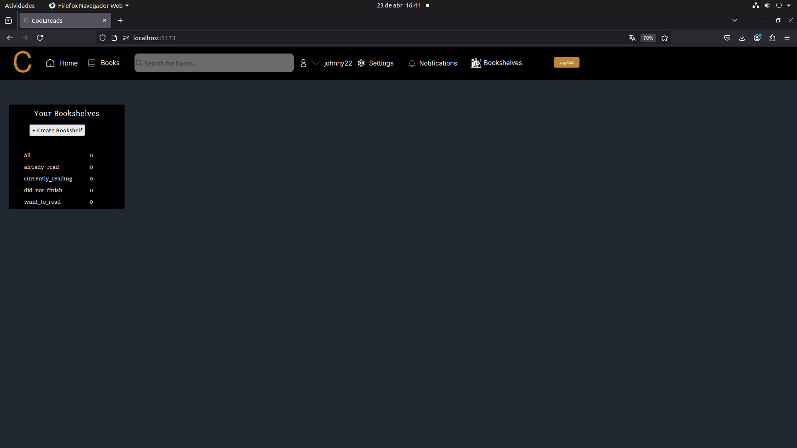
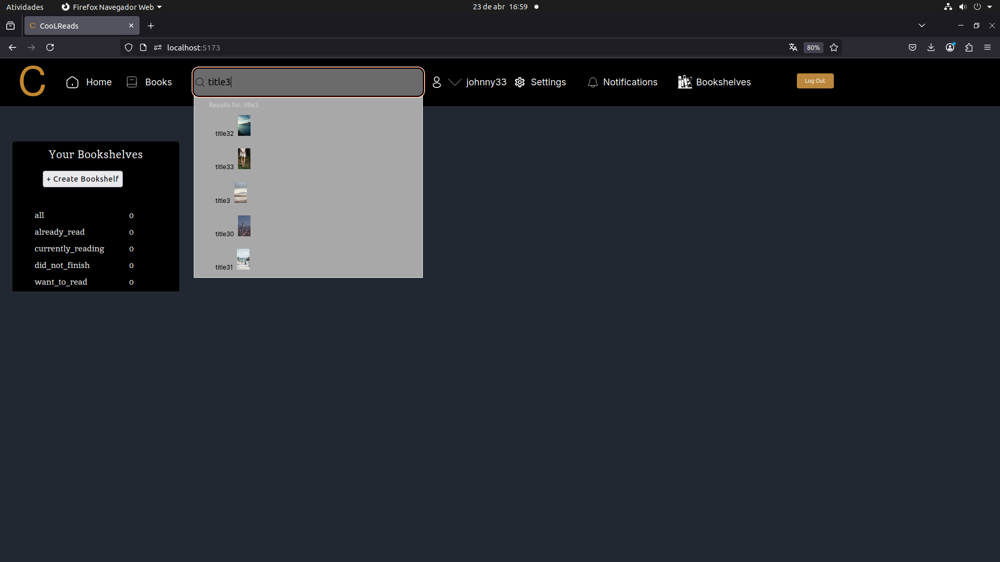
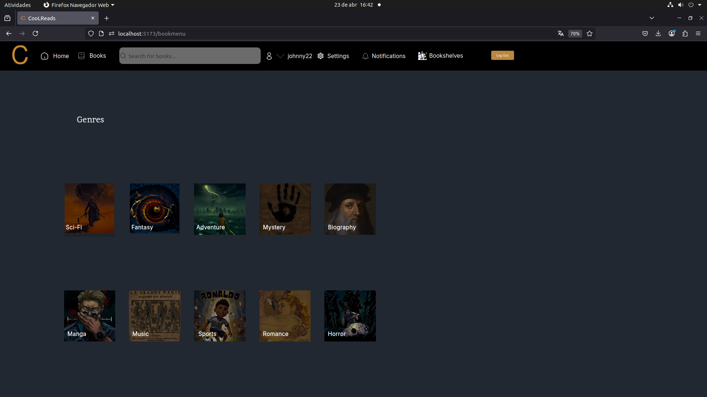
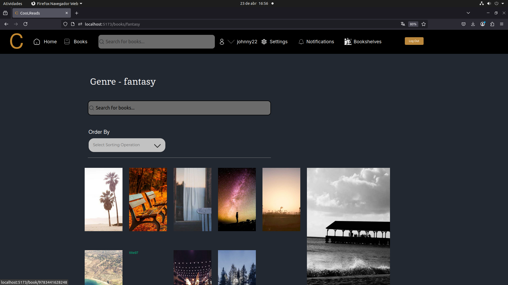
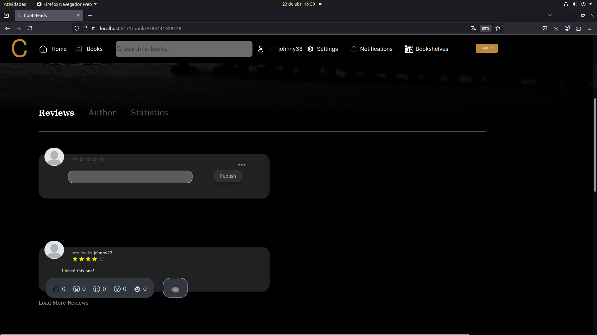

# 📚 CoolReads

CoolReads is a web application inspired by [Goodreads](https://www.goodreads.com/), designed to offer a more user-friendly and socially engaging platform for book lovers. Users can manage their personal libraries, track their reading progress, explore book recommendations, and connect with other readers.

---

## 🚀 Features

- 🧾 **Personal Bookshelves**: Create and customize your own bookshelves with names and organization methods that suit you.
- 📈 **Track Reading Progress**: Set reading statuses (Read, Want to Read, Currently Reading, Did Not Finish) and track how far you’ve gone.
- 🗣️ **Reviews and Ratings**: Share your thoughts on books you've read and engage with community reviews.
- 🧑‍🤝‍🧑 **Social Features**: Add friends, interact with other users’ reviews, and receive notifications.
- 🛠️ **Advanced Search**: Find books or users instantly with a responsive search interface.
- 📊 **Book Statistics**: Authors and users can view detailed analytics on book interactions.
- 🌐 **Multilingual Support**: Interface available in English and Portuguese.
- 🎨 **Modern UI**: Vue.js-powered frontend with dynamic and responsive components.

---

## 🧱 Tech Stack

### Frontend
- **Vue.js** – Modern JavaScript framework for building UI
- **Vuex** – State management
- **Vue Router** – Routing and navigation
- **Axios** – HTTP requests
- **Figma** – UI prototyping

### Backend
- **Java & Spring Boot** – Core business logic, REST API
- **Spring Security** – Authentication and authorization
- **Spring Data JPA (Hibernate)** – ORM and database interaction
- **Redis** – In-memory cache for performance
- **PostgreSQL** – Relational database

### DevOps & Deployment
- **Docker** – Containerization
- **Ansible** – Infrastructure automation
- **Google Kubernetes Engine (GKE)** – Scalable cloud deployment
- **GitHub Actions** – CI/CD pipeline

---

## 🏗️ Architecture

The project follows a layered architecture:

- **Presentation Layer**: Vue.js frontend + Spring MVC REST API
- **Business Layer**: Core logic in Spring Boot
- **Integration Layer**: Spring Data JPA (Hibernate)
- **Data Layer**: PostgreSQL + Redis

You can find system architecture diagrams and class designs in the `/VPP` folder.

---

## ⚙️ Setup & Deployment

### Local Development

1. **Frontend**:
   ```bash
   cd CoolReads/frontend
   npm install
   npm run serve
   ```

2. **Backend**:
   ```bash
   cd CoolReads/backend/coolreads
   sudo sh start.sh
   mvn spring-boot:run
   ```

### Docker

To build and run containers locally:
```bash
docker-compose up --build
```

### GKE Deployment (via Ansible)

1. Set your Google Cloud credentials.
2. Use Ansible to deploy:
   ```bash
   cd backend/ansible
   ansible-playbook gke-cluster-create.yml
   ansible-playbook coolreads-deploy.yml
   ```

---

## 🖼️ Screenshots

Here are some example views of the application in action. *(Insert your images in this section)*

### Home View 





### Categories View 





### Detail View 




### Bookshelf View 


To include your own screenshots, add them to a `screenshots/` folder in the root of the repository and update the image paths above accordingly.


---

## 📂 Project Structure

```
CoolReads/
├── backend/
│   ├── src/
│   ├── ansible/
│   └── VPP/
├── frontend/
│   └── src/
│       ├── components/
│       ├── views/
│       └── services/
└── Dockerfile
```

---

## 🧪 Usability & Evaluation

CoolReads was evaluated through:
- Expert-based heuristic evaluation
- Cognitive walkthroughs
- Empirical testing with early-stage users

Findings and user-centered design insights are documented in the `CoolReads___Arquitetura.pdf`.

---

## 📜 License

This project was developed as part of the *Arquiteturas Aplicacionais* course at University of Minho. All rights reserved to the student authors.

---

## 👥 Authors

- André Lucena
- Carlos Machado
- Gonçalo Sousa
- João Castro
- José Barbosa
